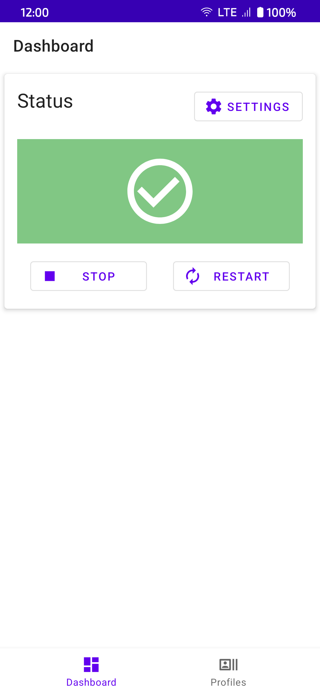
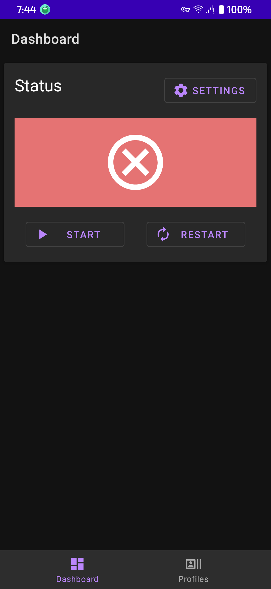
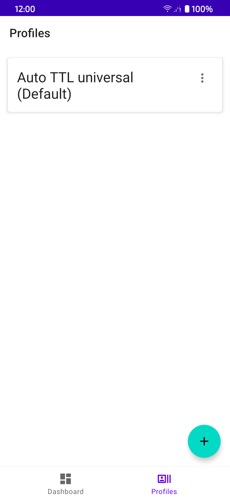

 <h1>DPI Tunnel for Android</h1>
Free, simple and serverless solution against censorship for Android

<a href="https://t.me/DPITunnelOFFICIAL">Telegram chat</a>
 
<a href="https://github.com/nomoresat/DPITunnel-cli">Want version for PC or router?</a>

 

### What is it
DPI Tunnel is a proxy server, that allows you to bypass censorship

It is NOT VPN and won't change your IP

DPI Tunnel uses desync attacks to fool DPI filters

### Features
* Bypass many restrictions: blocked or throttled resources
* Create profiles for different ISP and automatically change them when switch connection
* Auto start program on device boot
* Easily auto configure for your ISP
* Choose apps, which traffic handle
* Specify working IPs for huge blocked resources (Google, Facebook, Instagram)

## Configuring
For the most of ISPs you do not need any configuration. Just press start button.

For other ISPs program has option to automatically find proper settings

## Links
[Telegram chat](https://t.me/DPITunnelOFFICIAL)

[4PDA](https://4pda.to/forum/index.php?showtopic=1043778)

## Dependencies
* [libsu](https://github.com/topjohnwu/libsu)
